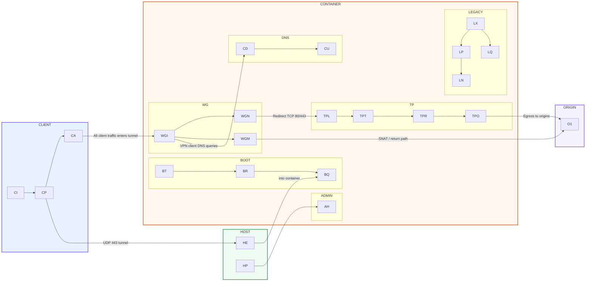
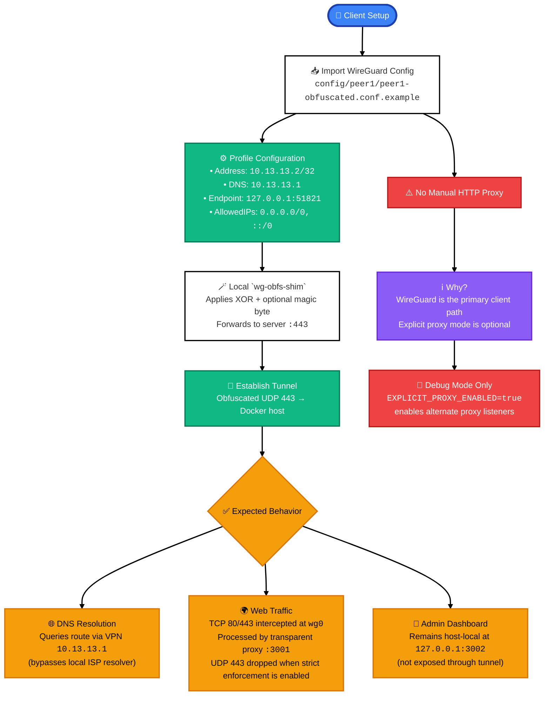

# System Architecture

## Runtime Data Plane



### Legend

#### CLIENT
- `CI`: Client Interface
- `CP`: Client Protocol
- `CA`: Client Application

#### HOST
- `HE`: Host Endpoint
- `HP`: Host Port

#### CONTAINER

##### BOOT
- `BT`: Bootstrap Task
- `BR`: Bootstrap Runner
- `BQ`: Bootstrap Queue

##### WG
- `WGI`: WireGuard Ingress
- `WGN`: WireGuard NAT
- `WGM`: WireGuard Masquerade

##### DNS
- `CD`: CoreDNS
- `CU`: CoreDNS Upstream

##### TP
- `TPL`: Transparent Proxy Listener
- `TPT`: Transparent Proxy Transit
- `TPR`: Transparent Proxy Relay
- `TPO`: Transparent Proxy Origin

##### ADMIN
- `AH`: Admin Handler

##### LEGACY
- `LX`: Legacy Entry
- `LP`: Legacy Proxy Listener
- `LQ`: Legacy Queue
- `LN`: Legacy Network Path

#### ORIGIN
- `O1`: Origin Server

## Client Expectations



## Port Assignments

| Service | Port | Protocol | Purpose |
|---------|------|----------|---------|
| WireGuard VPN | 443 | UDP | External obfuscated tunnel endpoint |
| Transparent Proxy | 3001 | TCP | Internal listener for redirected WireGuard traffic |
| Admin API + Dashboard | 3002 | TCP | Internal health, dashboard, and stats surface |
| Explicit Proxy | 3000 | TCP | Legacy opt-in listener, disabled by default |

`tunnel_blocked` indicates a denied network flow, not a guarantee that the entire site or app failed. Independent allowed flows can still complete.

## Component Startup Order

1. **CoreDNS** - Initializes the VPN DNS resolver and forwards upstream over DNS-over-TLS
2. **BoringTun** - Creates `wg0` as a userspace WireGuard-compatible TUN interface and establishes the encrypted client path
3. **ssl-proxy** - Starts transparent interception, obfuscation, and audit logging for tunneled traffic

## Obfuscation Profiles

Traffic is normalized per domain classification to prevent fingerprinting.

### Active Profiles

- **fox-news**: Fox News domain family
- **fox-sports**: Fox Sports domain family

### Applied Modifications

**Request Headers**
✅ Removes `X-Forwarded-For`, `Via`, `Forwarded` proxy headers
✅ Strips `DNT`, `Sec-GPC` privacy signals
✅ Normalizes User-Agent to configured standard value

**Response Headers**
✅ Removes `X-Cache`, `X-Edge-IP`, `X-Served-By` CDN leak headers
✅ Preserves security headers (CSP, HSTS)

Domain matching supports wildcard subdomains and is case-insensitive.

---

## Quick Start

1. **Setup secrets:**
   ```bash
   mkdir -p secrets
   echo "your-oracle-password" > secrets/oracle_password.txt
   ```

2. **Start stack:**
   ```bash
   docker compose up -d
   ```

3. **WireGuard Client Configuration:**
   Build and run the bundled Linux `wg-obfs-shim`, then import `config/peer1/peer1-obfuscated.conf.example` into the WireGuard client. The profile endpoint `127.0.0.1:51821` is local to the client machine; configure the real remote server endpoint separately in `config/client/wg-obfs-shim.env.example`. Do not combine this with a separate manual HTTP proxy on the client.

   Verify the service locally:
   ```bash
   curl -i http://127.0.0.1:3002/health
   ```

## Legacy Explicit Proxy Mode

The explicit HTTP/HTTPS proxy path is retained only for controlled debugging. It must be enabled explicitly with `EXPLICIT_PROXY_ENABLED=true`, and plaintext HTTP proxy mode still exposes `CONNECT host:443` metadata on the client-to-proxy leg.
