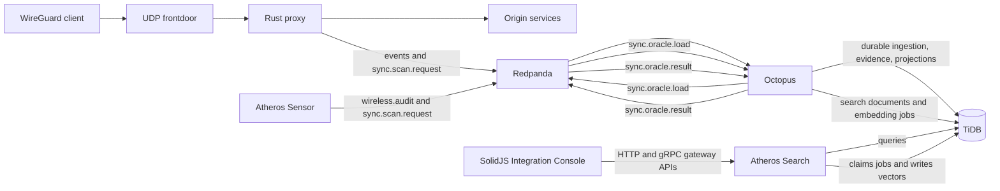
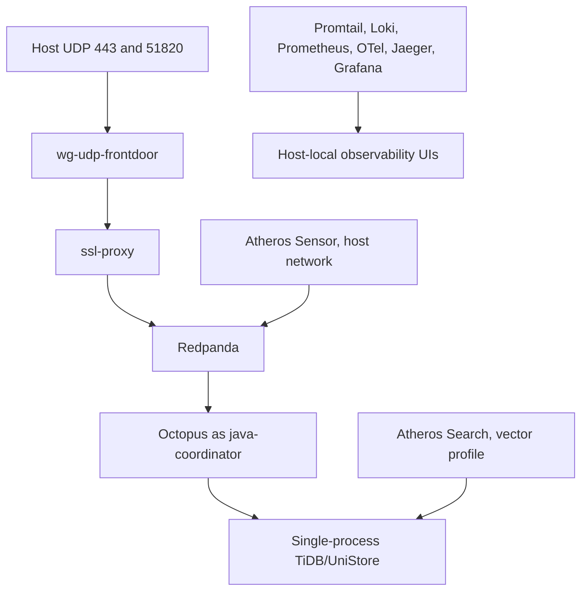
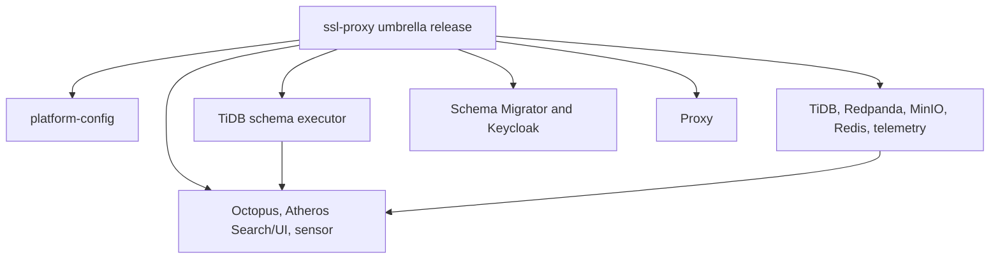
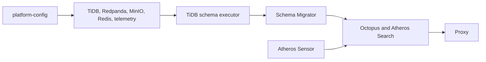

# System Architecture

This document is the canonical description of the current runtime. The
repository [README](../README.md) is the onboarding entry point; subsystem
READMEs describe only their local code and operations.

## Runtime at a glance

ssl-proxy is a WireGuard-first transparent proxy with a Redpanda-backed audit
and processing plane. The Rust proxy and Atheros Sensor publish events and work
discovery messages. Octopus durably ingests those messages into TiDB, records
per-topic/partition/offset evidence, manages leases and batches, publishes
outbox work, and maintains projections. Atheros Search serves the search API
and, when enabled, claims embedding jobs and writes vectors. The SolidJS
Atheros Search UI is the Integration Console.

```mermaid
flowchart LR
    client[WireGuard client] --> frontdoor[UDP frontdoor]
    frontdoor --> proxy[Rust proxy]
    proxy --> origin[Origin services]

    proxy -->|events and sync.scan.request| redpanda[Redpanda]
    sensor[Atheros Sensor] -->|wireless.audit and sync.scan.request| redpanda
    redpanda --> octopus[Octopus]
    octopus -->|durable ingestion, evidence, projections| tidb[(TiDB)]
    octopus -->|sync.oracle.load| redpanda
    redpanda -->|sync.oracle.load| octopus
    octopus -->|sync.oracle.result| redpanda
    redpanda -->|sync.oracle.result| octopus

    search[Atheros Search] -->|queries| tidb
    search -->|claims jobs and writes vectors| tidb
    ui[SolidJS Integration Console] -->|HTTP and gRPC gateway APIs| search

    octopus -->|search documents and embedding jobs| tidb
```

Solid edges are implemented flows. New Octopus processors and Atheros Search
workers remain disabled until their dependency-ordered rollout gates are
explicitly enabled.

## Component ownership

| Component | Implementation | Owns | Does not own |
|---|---|---|---|
| Proxy | Rust in [`src/`](../src/) | WireGuard ingress, transparent proxying, classification, admin/readiness surface, proxy-side sync publishing | Durable application state or database connections |
| Sync Plane | Rust in [`crates/sync-plane/`](../crates/sync-plane/) | Shared Redpanda producer configuration and message contracts | Ingestion state or projections |
| Atheros Sensor | Rust in [`services/atheros-sensor/`](../services/atheros-sensor/) | Monitor-mode capture, wireless event construction, Redpanda publishing, local backlog | Direct TiDB persistence |
| Octopus | Scala 3 in [`services/octopus/`](../services/octopus/) | Durable ingestion, dedupe, evidence, cursoring, leases, batching, outbox, TiDB load/results, maintained projections and alert derivation | Embedding execution or public search APIs |
| Atheros Search | Go in [`services/atheros-search/`](../services/atheros-search/) | HTTP/gRPC search, ETL health APIs, embedding-job claims, embedding calls, vector writes | Projection maintenance or alert derivation |
| Integration Console | SolidJS in [`apps/integration-console/atheros-search-ui/`](../apps/integration-console/atheros-search-ui/) | Browser UI for search, graph, inventory and ETL health | Rails runtime or direct database access |
| Schema Migrator | Scala 3 in [`apps/schema-migrator/`](../apps/schema-migrator/) | Migration definitions, validation, execution history and target connection CRUD | Provisioning the four application schemas at runtime |
| TiDB schema executor | Shell/container in [`k8s/tidb-schema-executor/`](../k8s/tidb-schema-executor/) | Applying the checksummed canonical manifests | Application data processing |
| WireGuard key rotator | Elixir in [`apps/wg-key-rotator/`](../apps/wg-key-rotator/) | Staged peer and server key rotation | Proxy traffic handling |

The Helm and Compose service identity `java-coordinator` is a legacy deployment
name for the Scala Octopus service.

## Durable state and database boundaries

The canonical schema source is [`sql/tidb/`](../sql/tidb/). It defines four
application domains and a shared contract layer:

| Database | Runtime owner | Purpose |
|---|---|---|
| `octopus_core` | Octopus | Ingestion evidence, dedupe, jobs, batches, cursors, leases, outbox and core projections |
| `atheros_search` | Octopus and Atheros Search with table-level grants | Search documents, embedding jobs, vectors and search-facing projections |
| `integration_console` | No current application runtime | Reserved console-domain tables; see [Known gaps](#known-gaps) |
| `schema_migrator` | Schema Migrator | Internal connection, execution and migration-control state |

The shared [`contracts`](../sql/tidb/contracts/) manifest records cross-domain
schema contracts. Helm also creates a separate `keycloak` database for the
in-cluster Keycloak deployment. It is not one of the four application
manifests.

Only the provisioning schema executor may apply canonical DDL. Application
runtimes verify the recorded manifest checksum and fail closed when the schema
contract is not ready. PostgreSQL is not an internal runtime store. Schema
Migrator supports it only as an explicitly configured external migration
target. Oracle material is deprecated or historical.

## Topic contracts

The sync topic names are compatibility surfaces and are intentionally locked:

| Topic | Direction | Meaning |
|---|---|---|
| `sync.scan.request` | Proxy or sensor to Octopus | Work discovery with stream, dedupe and payload-reference metadata |
| `sync.oracle.load` | Octopus dispatch to Octopus TiDB load consumer | Coordinator-owned TiDB load work; `oracle` is a legacy name |
| `sync.oracle.result` | Octopus TiDB load consumer to Octopus result consumer | TiDB load outcomes; `oracle` is a legacy name |
| `wireless.audit` | Sensor to Redpanda/Octopus | Schema-versioned wireless audit events |

Delivery is at least once after the signed cutover offset. TiDB uniqueness,
dedupe keys and topic/partition/offset evidence make replay and duplicate
delivery observable and retry safe.

Small payloads may use `inline://json/` references. Filesystem-spooled payloads
use `outbox://` references and must resolve to JSON in the shared outbox.

## Search and embedding flow

```mermaid
sequenceDiagram
    participant O as Octopus
    participant D as TiDB atheros_search
    participant W as Atheros Search workers
    participant E as Embedding backend
    participant A as Search API
    participant U as SolidJS UI

    O->>D: Prepare search_documents and embedding_jobs
    W->>D: Claim pending jobs; commit token and fence
    W->>E: Embed normalized text in batches
    E-->>W: 768-dimension vectors
    W->>D: Atomically write vector and complete matching fenced job
    U->>A: Search, graph, inventory, ETL health
    A->>D: Dense, sparse or hybrid query
    D-->>A: Ranked results
    A-->>U: HTTP, NDJSON or WebSocket response
```

Atheros Search workers are enabled with `ATHSEARCH_WORKER_ENABLED=true`.
Worker count, batch size, lease duration and poll interval are configured with
the `ATHSEARCH_WORKER_*`, `ATHSEARCH_EMBEDDING_BATCH_SIZE`,
`ATHSEARCH_LEASE_SECONDS` and `ATHSEARCH_POLL_INTERVAL_MS` variables documented
in the [Atheros Search README](../services/atheros-search/README.md).

## Deployment models

Ports below describe the declared configuration, not a promise that every
profile is production ready. Use the deployment-specific README before
operating a stack.

### Compose compatibility stack

[`docker-compose.yaml`](../docker-compose.yaml) is a compatibility and local
development topology. It bundles single-process TiDB/UniStore, Redpanda, MinIO
and observability services. The `vector` profile adds Atheros Search.

```mermaid
flowchart TB
    host443[Host UDP 443 and 51820] --> fd[wg-udp-frontdoor]
    fd --> proxy[ssl-proxy]
    proxy --> rp[Redpanda]
    sensor[Atheros Sensor, host network] --> rp
    rp --> oct[Octopus as java-coordinator]
    oct --> tidb[Single-process TiDB/UniStore]
    search[Atheros Search, vector profile] --> tidb
    obs[Promtail, Loki, Prometheus, OTel, Jaeger, Grafana] --> view[Host-local observability UIs]
```

The frontdoor owns UDP `443` and `51820`. Proxy ports `3001` and `3002`,
frontdoor health `3003`, TiDB `4000`, search `8080`, and most observability
ports are host-local. Grafana is declared on `3004` and Jaeger on `16686`.
Profile-dependent ports are documented in the [root README](../README.md) and
[runbook](runbook.md).

### Umbrella Helm release

[`helm/ssl-proxy/`](../helm/ssl-proxy/) is the compatibility Kubernetes
deployment. The umbrella chart declares 13 dependencies: `platform-config`,
`proxy`, `java-coordinator`, `schema-migrator`, `atheros-sensor`, `redpanda`,
`minio`, `tidb`, `telemetry`, `vec-worker`, `atheros-search`,
`redis-runtime`, and `tidb-schema-executor`. `vec-worker` is disabled and
retained only as a compatibility chart; its runtime responsibility moved into
Atheros Search.

```mermaid
flowchart TB
    umbrella[ssl-proxy umbrella release] --> shared[platform-config]
    umbrella --> infra[TiDB, Redpanda, MinIO, Redis, telemetry]
    umbrella --> schema[TiDB schema executor]
    umbrella --> migrator[Schema Migrator and Keycloak]
    umbrella --> apps[Octopus, Atheros Search/UI, sensor]
    umbrella --> edge[Proxy]
    schema --> apps
    infra --> apps
```

The single-node `values-k8s.yaml` overlay enables the schema executor, Schema
Migrator, Search and UI, and exposes selected host ports. Default values and
the overlay have different operational assumptions; always render the exact
values used for a deployment.

### Opt-in stackctl split releases

[`stackctl/stack.yaml`](../stackctl/stack.yaml) deploys the same subcharts as
separate releases with dependency gates. It is opt in through
`make up-ready-stackctl` or the `make stackctl-*` targets.

```mermaid
flowchart LR
    bootstrap[platform-config] --> infra[TiDB, Redpanda, MinIO, Redis, telemetry]
    infra --> executor[TiDB schema executor]
    executor --> migrator[Schema Migrator]
    migrator --> apps[Octopus and Atheros Search]
    apps --> proxy[Proxy]
    sensor[Atheros Sensor] --> apps
```

stackctl owns release ordering, gates, checks and failure diagnostics. Image
builds, secrets, TLS generation and node preparation stay in the surrounding
operations workflow. See the [stackctl README](../stackctl/README.md).

## Observability

Container logs flow through Promtail to Loki. Prometheus scrapes application
and infrastructure metrics. OTLP traces flow through the OpenTelemetry
Collector to Jaeger; the collector also exposes span-derived Prometheus
metrics. Grafana provisions Prometheus, Loki and Jaeger data sources. The
complete topology and current instrumentation limits are in
[Observability Architecture](observability-architecture-jaeger.md).

## Security boundaries

- WireGuard UDP entrypoints are public; admin, database and observability
  surfaces should remain host-local or cluster-internal.
- The proxy and sensor have elevated network capabilities. They do not receive
  database credentials.
- TiDB clients use separate accounts and databases, verified TLS and the
  table-level grant matrix in [TiDB Runtime Cutover](tidb-runtime-cutover.md).
- Secrets are materialized outside Git and mounted or referenced through
  Kubernetes Secrets. See [Secret Management](secret-management.md).
- Search analytics store hashes instead of raw queries or session identifiers
  by default. See [Atheros Search Privacy](atheros-search-privacy.md).

## Known gaps

These are documentation of current limitations, not hidden future behavior:

1. No current application runtime owns the `integration_console` tables. The
   Integration Console is the SolidJS Atheros Search UI and reads through the
   Search API.
2. Atheros Search installs HTTP/gRPC tracing hooks, but the server does not
   initialize an OTLP exporter or SDK tracer provider. Setting
   `OTEL_EXPORTER_OTLP_ENDPOINT` alone does not export its spans.
3. Compose and the default single-node Kubernetes overlay run TiDB with
   UniStore. That topology does not demonstrate production TiFlash placement,
   distributed failure tolerance or vector-index readiness. Production claims
   require a real TiDB/TiFlash cluster and an explicit readiness rehearsal.

Until these gaps are closed, deployment success means the declared health
gates passed; it does not prove production-grade TiFlash/vector capacity.
