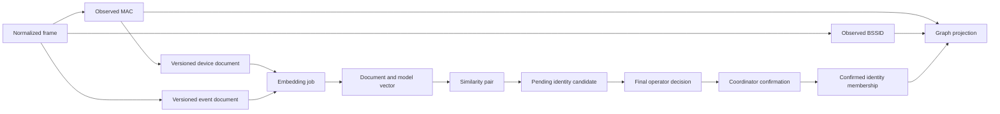

# Atheros reporting data contract

> **Status: Source-reviewed contract and proposed reporting rules.** Reviewed
> on 2026-09-27 at root commit `1316324e` and Integration Console commit
> `18c56d1`. Table existence and writer capability do
> not establish deployed population, freshness or coverage. Proposed fields
> and invariants below are implementation requirements, not existing API promises.

Use this with the [reporting workmap](atheros-reporting-workmap.md) and
[system architecture](architecture.md). Canonical DDL is controlled by
[the Atheros Search manifest](../sql/postgres/atheros_search/manifest.yaml) and
[the Octopus manifest](../sql/postgres/octopus_core/manifest.yaml). Later ordered
files alter earlier definitions; reading the initial `CREATE TABLE` alone does
not describe the final contract.

## Business vocabulary

| Term | Valid meaning | Invalid inference |
|---|---|---|
| Observed identifier | A MAC present in retained wireless evidence | One physical device, an owned asset or a currently connected client |
| Registered asset | A trusted registration reference with provenance | Every row in `devices` |
| AP | A BSSID represented by qualifying wireless evidence | A proven authorized network or a geographic location |
| Observed AP context | Frames connecting a source identifier and BSSID in evidence | A verified association/session |
| Pending identity candidate | A scored pair awaiting a recorded decision | An equivalence class or confirmed same device |
| Confirmed identity membership | Coordinator-maintained membership under the confirmation rules | A group synthesized for graph layout |
| Similarity | A method/model-specific relationship between documents | Calibrated identity probability, incident severity or causal relationship |
| Last observed | Latest event time represented by the source | Pipeline freshness or current online status |
| Generated at | Time the API response was constructed | Time the underlying evidence was last ingested/projected |

## Tables, grains and ownership

The following inventory covers the data families feeding the reporting surfaces.
Ingest ledgers, migration control and Keycloak are supporting operational
domains; they are not reportable device entities.

| Schema/table family | Grain and key | Relationship and business role | Writer / consumer |
|---|---|---|---|
| `octopus_core.wireless_observations` | Event ID with unique consumer-group/topic/partition/offset receipt | Source evidence and ingest accountability | Octopus / projections |
| `octopus_core.wireless_frames` | One normalized frame per `dedupe_key` | Event source for Search, AP observations and time-based investigations | Octopus / projections and preparation |
| `octopus_core.wireless_frame_radio`, `wireless_frame_qos`, `wireless_frame_network`, `wireless_frame_app_signals`, `wireless_frame_identity`, `wireless_frame_security` | Typed frame enrichment keyed by `dedupe_key` | Logical frame joins; enrichment presence differs by frame/source | Octopus / preparation and projection |
| `octopus_core.devices` | One normalized MAC identifier | Core first/last-observed device projection | Octopus / graph and inventory projection |
| `octopus_core.registered_devices` | Device UUID; unique MAC | Trusted registered identity, where supplied; provenance required | Registration data path / identity and graph projection |
| `octopus_core.wireless_clients` | SSID/client MAC pair | Observed client detail; distinguish client role from generic identifier | Octopus / projection |
| `octopus_core.sensors` | Sensor identifier | Capture source/heartbeat context; required for coverage interpretation | Octopus / operational monitoring |
| `octopus_core.wireless_authorized_networks` | Authorized network/BSSID configuration | Explicit authorization evidence; separate from AP discovery | Octopus operational path / processors |
| `octopus_core.wireless_alerts`, `wireless_shadow_alerts` | Alert UUID / source MAC state respectively | Evidence-backed alert subjects and resolution state | Octopus / graph and risk projection |
| `octopus_core.wireless_inventory_projection_inputs`, `wireless_shadow_alert_inputs` | Durable processor input rows | Projection work inputs, not independent observations to count again | Octopus / processors |
| `octopus_core.proxy_events` | Event ID | Independent proxy evidence for Search; no automatic wireless asset join | Octopus / search preparation |
| Derived proxy blocked-host documents | Host/device-key/closed UTC-hour aggregate from `proxy_events` | Search document kind `proxy_blocked_host_window`; no separate source table is created | Octopus preparation / Search |
| `atheros_search.devices` | **One MAC**, primary key `mac` | Search-facing identifier registry; optional registration, owner, location and aliases | Octopus / Inventory and device document preparation |
| `atheros_search.search_documents` | Versioned source record, `document_id`; source identity uniqueness | Shared sparse-search text/details and document identity; active/superseded lifecycle | Octopus / Search and workers |
| `atheros_search.embedding_jobs` | Document/kind/model/content checksum job | Fenced worker processing state; not a report result or observation | Octopus prepares; Atheros Search executes |
| `atheros_search.embeddings` | Document/kind/model vector | Current dense retrieval reads this family | Atheros Search / Search and similarity projection |
| `atheros_search.search_vectors_event`, `search_vectors_device`, `search_vectors_behaviour`, `search_vectors_sequence` | Document/model vector per kind | Parallel worker vector contracts; not extra distinct devices or evidence | Atheros Search / vector consumers |
| `atheros_search.search_document_tokens`, `search_document_tags` | Document/token/field and document/tag-type/value | Search indexes/metadata; avoid multiplicative joins in row/count queries | Preparation paths / search consumers |
| `atheros_search.behaviour_snapshots` | Snapshot UUID; source MAC and window | Windowed derived behavior, with projection-run provenance | Octopus / preparation and analysis |
| `atheros_search.frame_sequences` | Session key and window | Ordered derived frame sequence; not a live network session guarantee | Octopus / preparation and analysis |
| `atheros_search.timing_profiles` | Profile UUID/key and window | Derived timing characteristics | Octopus / analytical projections |
| `atheros_search.baseline_profiles` | Baseline UUID; unique BSSID/metric | Baseline quantiles and sample counts | Octopus / risk derivation |
| `atheros_search.sequence_transitions`, `sequence_transition_contributions`, `sequence_previous_totals` | Transition, contribution and previous-token totals | Internal sequence-model state; do not expose as inventory rows | Octopus / sequence projection |
| `atheros_search.similarity_pairs` | Pair UUID with method/model/document-pair uniqueness | Scored pair with source metadata and evidence | Octopus / identity and analytical consumers |
| `atheros_search.v_vec_similarity_audit` | Pair UUID | Maintained audit **table**, despite its view-like name; joined pair detail | Octopus / investigation |
| `atheros_search.similarity_scan_state` | Embedding-kind/vector-ID pair | Incremental similarity work bookkeeping | Octopus / similarity processor |
| `atheros_search.merge_candidates` | Candidate ID; unique MAC pair | Pair score, evidence, pending/decision/confirmation lifecycle | Octopus proposes/projects; Search records decisions |
| `atheros_search.merge_decisions` | Candidate ID | Final decision, caller and timestamp; owned child of candidate | Atheros Search / Octopus confirmation |
| `atheros_search.identity_clusters` | Cluster ID | Maintained confirmed identity group metadata | Octopus / graph consumers |
| `atheros_search.identity_cluster_members` | Primary key **MAC**, indexed cluster ID | Many members to one cluster; one stored cluster per MAC | Octopus / identity graph |
| `atheros_search.graph_nodes`, `graph_edges` | Node ID / edge ID | Materialized relationship projection with kind, evidence and run metadata | Octopus / network map |
| `atheros_search.threat_signals`, `ap_risk_scores` | Source key / BSSID respectively | Derived signals and decomposed AP risk; separate from identity confidence | Octopus / search ranking and graph |
| `atheros_search.search_queries` | Query analytics row | Hashed analytics with expiration; not raw operator query storage | Atheros Search / operational analysis |
| `atheros_search.worker_heartbeat`, `schema_readiness` | Worker / readiness contract state | Pipeline health and fail-closed schema gate | Search/runtime provisioning / health |

Sources: [wireless source DDL](../sql/postgres/octopus_core/01_tables/005_wireless_sink.sql),
[normalized wireless state](../sql/postgres/octopus_core/01_tables/008_legacy_wireless_state.sql),
[core sink extensions](../sql/postgres/octopus_core/01_tables/010_legacy_sinks_and_leases.sql),
[registration DDL](../sql/postgres/octopus_core/01_tables/002_sync_state.sql),
[document and identifier DDL](../sql/postgres/atheros_search/01_tables/002_search_documents.sql),
[vector DDL](../sql/postgres/atheros_search/01_tables/003_search_vectors.sql),
[projection DDL](../sql/postgres/atheros_search/01_tables/004_projection_state.sql),
[vector recovery extensions](../sql/postgres/atheros_search/01_tables/009_embedding_recovery_contract.sql),
[identity DDL](../sql/postgres/atheros_search/01_tables/011_identity_graph.sql)
and [confirmation guards](../sql/postgres/atheros_search/01_tables/016_guarded_identity_confirmation.sql).

## Relationship model

Arrows show logical lineage, not enforced foreign keys or synchronous updates.
No automatic identity confirmation is justified by vector score alone: current
guards also require a nonempty shared trusted registration for the automatic
path. Human decisions are recorded first and applied by the coordinator later.
An accepted decision is not proof that alias arrays or inventory rows have
already been consolidated.

Do not add a foreign key to every high-volume fact as part of a UI redesign.
Retain ingestion and retention boundaries. Validate logical relationships with
bounded reconciliation and projection tests; use constraints deliberately for
low-volume owned state. Candidate-owned decision cascades are not a strategy
for deleting observation history.

## Field and count rules

1. `devices.mac` identifies a row, while `registered_device_id` is optional.
   Count distinct MACs as identifiers. A physical-asset count requires a
   separately agreed identity/registration denominator.
2. Canonical ingestion can add source, transmitter, receiver and BSSID-related
   addresses. Do not call every inventory row a client. Exclude broadcast and
   classify roles only with an explicit evidence rule.
3. `active` is stored projection state and is set true by observed ingestion.
   It is not an online/offline heartbeat. Present last observed directly;
   any recency category must state its interval and coverage limitations.
4. `first_seen` is observation time; `first_registered` is registration time.
   Current Inventory does not return `first_seen`; add it from the source for
   new/returning claims. Current Graph copies `observed_at` into both first and
   last timestamps; these must not drive a timeline.
5. Owner/location are optional strings in identifier records. The reviewed
   report paths do not establish a complete managed owner/location catalog.
   Missing means unknown/unassigned. A capture site is not automatically an
   asset's assigned location.
   Observed ingestion does not supply owner or trusted registration identity;
   an authoritative registration/assignment path is a prerequisite for claiming
   asset-management completeness. A useful identifier report can ship while
   those fields remain explicitly unknown.
6. Inventory `similarity_cluster_id` and `dedup_confidence` are synthesized
   pending-pair fields in similarity grouping. Use a candidate list keyed by
   candidate ID; never select cluster siblings through a single node field.
7. Confirmed membership comes from `identity_cluster_members`; pending review
   belongs to `merge_candidates`. Keep these types and states separate in UI.
8. AP roster counts use qualifying distinct observed identifiers in the same
   scope, independently of loaded graph nodes. Exclude AP self-frames. RF
   proximity, vendor or channel similarity does not constitute connectivity.
9. Edge weight requires `weight_basis`: frame count, cluster confidence and
   cosine similarity have different units. Do not compare them as one score.
10. Filtered counts, rows and pagination must share predicates. The current
    `total_registered_count` is global; label it separately. Do not substitute
    total devices when registration counts are unavailable.

## Graph presentation contract

The Go [reporting API](../apps/integration-console/atheros-search/internal/reporting/graph_types.go)
returns flat `nodes[]` and `edges[]`. Every returned edge resolves both endpoints
in the same response, including an individual overview page. Overview pages may
repeat nodes to include an edge's endpoints; clients deduplicate by node ID.
Page size bounds the primary node and edge pages, rather than the number of
endpoint nodes included for closure.

With `hierarchy=true`, the API returns an association neighborhood and
presentation fields: node `parent_id`, `depth` and `role`; edge `tree_role`
(`tree` or `secondary`); and `hierarchy` with `root_id`, `root_ids`, `truncated`
and an optional `reason`. These fields do not change the canonical database
schema or establish physical ownership or verified connectivity. Stored
association edges run from device to AP; their source and target stay intact.
The presentation parent can therefore be the edge's target.

`root_node_id`, `root_bssid` and the existing `source_mac` select a root. Without
an override, authorized APs rank before other APs, followed by latest catalog
observation and a deterministic ID tie break. Association traversal is cycle
safe and does not use the overview hop cap. A device observed at several APs
keeps its relationships, while only one discovery edge supplies its tree
parent. Other relationship kinds remain secondary and never establish tree
parents. Returned nodes without a presentation parent remain forest roots;
the UI displays unattached identifiers in an Unattached group.
The default view includes scoped identifiers without association edges after
the selected AP neighborhood. If no scoped AP exists, it still returns an
unattached forest. Explicit root requests stay within that root's neighborhood.

Hierarchy requests use an explicit node bound (default and maximum 1000),
retain the selected root, and report any omitted neighborhood through
`hierarchy.truncated` and `reason`. `page_cursor` is rejected in this mode;
overview pagination remains available. Filter scope still applies, so a
complete returned neighborhood is not a claim of complete sensor coverage.
Association edges with absent projected endpoints are omitted to preserve
closure and also set the hierarchy's partial-state reason.

The SolidJS [graph hooks](../apps/integration-console/atheros-search-ui/src/hooks/)
uses a deterministic horizontal tree with node spacing and fitted bounds.
Secondary relationships can be shown without changing tree placement.
Overview and grouped views use calibrated force layouts. The graph chrome
reports truncation, incomplete overview loading and relationships hidden by
client filters.

## Capability and freshness rules

Octopus source preparation supports event, device, behaviour, sequence and
proxy sources. The current Go public Search API supports event, device,
proxy-event and blocked-host-window sources; Cross combines those four.
Behaviour/sequence preparation is not authorization to revive retired public
search kinds. Report unsupported separately from not-yet-indexed.

Verify documents, jobs and vectors for the requested active document version
and model. Counting any embedding of a kind is insufficient to establish
complete current coverage. Show response generation separately from ingestion
and projection watermarks; a completed cursor loop only covers its query,
not everything a sensor might have failed to capture.

Temporal reports need retained frame time, projection completeness and sensor
coverage. Graph edges aggregate by source MAC/BSSID and retain latest time;
they cannot reconstruct an arbitrary historical association interval. Use a
bounded Octopus-owned projection if later activity queries need aggregation.
Search remains the query owner; keep the browser and sensor database-free.

## Read-only deployment evidence to capture before release

Use authorized read-only access and a captured `as_of` time. These checks are
requirements; they were not run against production in this review.

An implementation audit on Wiretrap at 2026-10-08 13:14:13 UTC used read-only
database transactions. The legacy graph had 304 `observed_at` edges, all directed
device to AP, and 71 absent device endpoints. The busiest AP had 67 projected
relationships but only 21 resolvable graph device nodes; retained frames for
that AP represented 5,593 distinct source identifiers. These are different
grains and scopes, not equivalent client counts. The stream topology edge table
was empty. Direct graph API verification returned HTTP 401 without an operator
session. No deployment state was changed.

Coordinator follow-up (same day, code only): `IdentityGraphSql.projectGraph`
now requires both edge endpoints to exist before writing, deletes any edge
still missing an endpoint, and prefers unprojected device/pair work before
recency refresh. Device nodes remain inventory-sourced (`octopus_core.devices`);
no placeholder nodes are synthesized. A `graph_projection` row in
`investigation_watermarks` reports projected pair coverage. Stream topology
enablement is a separate config change (`WIRELESS_PROJECTION_MODE=shadow`);
live wiretrap re-check is still required before those numbers are trusted.

| Check | Evidence | Required interpretation |
|---|---|---|
| Source coverage | Retained event range per sensor/site; heartbeat and ingestion lag | Missing coverage produces unknown, not zero activity |
| Projection freshness | Last completed relevant run and input watermark | Distinguish lag from no matching entity |
| Document/vector coverage | Active documents with current model/checksum vectors, by supported kind | Ready / partial / unavailable, with numerator and denominator |
| Identity integrity | Candidate endpoints, one decision per candidate, confirmation provenance and member/cluster consistency | Pending pairs cannot inflate confirmed asset counts |
| Graph integrity | Missing endpoints, node/edge kind mappings and run consistency | Explain temporary projection lag; prevent false absence |
| Inventory integrity | MAC normalization, alias duplicates, first <= last, registration provenance | Do not double count aliases as physical assets |
| Query correctness | Identical predicates for row/count/detail/AP roster queries | Same scope produces the same evidence across views |
| Retention and privacy | Running retention, privilege matrix and deletion of derived data | Schema declarations alone do not prove operational execution |

Prefer aggregate output over copying identifiers. Capture query latency and
an execution plan on representative non-production fixtures before adding
indexes. Any schema changes are ordered additions with updated checksums and
grants, applied by the provisioning executor, never by a runtime application.
