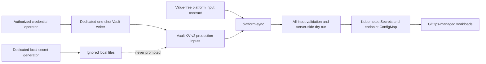

# Key Generation and Management Refactor Plan

> **Status: Active planning document.** This change documents the target and
> retirement sequence; it does not remove or refactor runtime code.

Production credentials have one source of truth: HashiCorp Vault KV-v2 under
`secret/ssl-proxy/prod`. The value-free
[`platform-input-contract.yaml`](../cyber-stack/platform-input-contract.yaml)
defines the 18 Kubernetes Secrets and one ConfigMap that platform-sync may
materialize. Local-development generators are not production provisioning
tools.

## Decisions

1. Keep `services/platform-sync` as the production Vault-to-Kubernetes reader,
   validator and constrained writer.
2. Keep `services/platform-sync/cmd/cred-gen` as the host-only generator of a
   one-hour Kubernetes ServiceAccount credential. It does not generate workload
   secrets.
3. Keep `scripts/bootstrap-vault-platform-sync.sh` as the one-time creator of
   the renewable `platform-sync-ro` Vault token. It requires a Vault
   administrator and must never run with an application or platform-sync token.
4. Separate local secret generation from WireGuard rotation.
5. Treat `apps/wg-key-rotator` as local/legacy compatibility code and a
   retirement candidate. It is not part of the production Kubernetes stack.
6. Do not automate production WireGuard rotation until the Kubernetes handover
   and rollback design is implemented and tested.

## Current tool inventory

| Surface | Current role | Production status | Direction |
|---|---|---|---|
| `cyber-stack/platform-input-contract.yaml` | Names every production input, Vault path and allowed key | Authoritative | Keep and add ownership metadata when the schema is extended |
| `services/platform-sync` | Reads all 19 inputs, validates them and writes only declared objects | Active | Keep; retain read-only Vault and name-scoped Kubernetes identities |
| `services/platform-sync/cmd/cred-gen` | Requests a short-lived Kubernetes token and writes an ephemeral kubeconfig | Active host helper | Keep; never turn it into a workload-secret generator |
| `scripts/bootstrap-vault-platform-sync.sh` | Creates the renewable read-only Vault service token | Active one-time bootstrap | Keep; require administrator capability preflight and immediate removal of temporary root access |
| `scripts/gen-secrets` | Generates local files and a local environment by loading `WgKeyRotator.Secrets` | Local compatibility | Extract into a dedicated local-only tool, preserving output and permission tests |
| `apps/wg-key-rotator/lib/.../secrets.ex` | Implements the local generator used by `scripts/gen-secrets` | Coupling only | Remove the coupling before retiring the application |
| `apps/wg-key-rotator` staged rotation | Generates keys, writes checkout-local files and controls Docker Compose services | Not production-capable | Retire after local generator extraction unless a separately approved local harness still needs it |
| Vault Shamir material | Emergency authorization for unseal and root recovery | Break-glass only | Split custody and encrypted offline storage; never use as a routine generator |

## Why the WireGuard rotator is not a production component

- No `wg-key-rotator` workload exists under `cyber-stack/`.
- The root Makefile explicitly excludes it from deployable Kubernetes images.
- Its deploy and handover paths call `docker compose` services such as
  `ssl-proxy-next` and `wg-udp-frontdoor`.
- A clean repository checkout has no general `docker-compose.yaml` containing
  those services; only build and CI Compose files remain.
- Rotation writes `config/server/` and `secrets/` files in a local checkout.
- It has no Vault KV-v2 writer, platform-input-contract integration, Kubernetes
  Secret update, or Argo CD rollout contract.

Publishing its compatibility image does not deploy it and does not rotate the
production WireGuard identity.

## Target ownership model

The production writer and reader must be separate identities. The writer may
update only reviewed Vault paths and must not have Kubernetes write access. The
platform-sync reader may read only the production prefix and obtains a
short-lived, name-scoped Kubernetes writer credential for each run. Application
workloads receive only their declared Secret projections.

## WireGuard rotation target

The current production proxy consumes the complete `wireguard-config` object,
including server configuration, private/public keys, two peer profiles and
preshared keys. A safe rotation must treat that key set as one versioned unit.

Before automation is accepted, the design must provide:

1. candidate generation outside the repository;
2. validation that private/public pairs, peer profiles and preshared keys agree;
3. a peer overlap or dual-generation handover window;
4. observable candidate health and recent handshakes;
5. a GitOps-compatible activation mechanism rather than an interactive
   Deployment restart;
6. rollback to the prior Vault version and configuration generation;
7. revocation and destruction of the old private material after acceptance.

Platform-sync must remain a synchronizer, not become the rotation orchestrator.
Until a reload or dual-generation workload contract exists, production
WireGuard rotation is a reviewed platform operation, not a cron job.

## Workmap

### Phase 0 - Documentation truth

- Mark the rotator local/legacy and remove production usage claims.
- Document platform-sync installation, monitoring and recovery.
- Make Vault, the input contract and GitOps ownership explicit.

### Phase 1 - Inventory and parity tests

- Map every local generator output to an active local consumer or mark it
  obsolete.
- Map every production input to one owner, creation method, rotation method and
  revocation check.
- Add tests proving the contract and documentation inventory stay aligned.
- Identify deprecated Oracle and WAHA material that can be removed from local
  generation.

### Phase 2 - Extract local secret generation

- Move the behavior behind `scripts/gen-secrets` into a dedicated local-only
  tool outside `apps/wg-key-rotator`.
- Preserve refusal-to-overwrite behavior, restrictive permissions, one-time
  token handling and output-parity tests.
- Remove requirements for nonexistent Compose services and unrelated rotation
  state.

### Phase 3 - Introduce a narrow production writer

- Define a separate Vault policy for reviewed creation and rotation operations.
- Require explicit target paths, input schemas, dry-run validation and audit
  metadata without values.
- Do not reuse the `platform-sync-ro` token or Kubernetes writer identity.
- Add token revocation and failed-operation cleanup tests.

### Phase 4 - Implement Kubernetes-safe WireGuard rotation

- Choose and document reload versus dual-generation handover.
- Add candidate/active generation state and peer migration evidence.
- Make activation and rollback compatible with Git-owned desired state.
- Prove uninterrupted handshakes and rollback in a disposable environment.

### Phase 5 - Retire compatibility code

- Remove `apps/wg-key-rotator`, its image publication target, tests and cron
  example if no approved local consumer remains.
- Remove obsolete local secret outputs and environment variables.
- Update the root component inventory and CI publication count.

### Phase 6 - Recovery hardening

- Revoke superseded broad Vault tokens after consumer migration.
- Remove invalid initial root tokens from routine operator paths.
- Split Shamir shares among custodians or encrypted offline locations instead
  of keeping quorum material in one online bundle.
- Exercise root recovery, service-token replacement and incident rollback with
  values suppressed from logs.

## Acceptance criteria

- No production how-to invokes `scripts/gen-secrets` or `wg-key-rotator`.
- Every contract input has exactly one documented production owner.
- Platform-sync can read Vault but cannot create, update, patch or delete Vault
  secrets.
- The Kubernetes writer remains namespace- and name-scoped and short-lived.
- No credential value appears in Git, command arguments, logs, metrics or
  documentation examples.
- Rotation has candidate validation, overlap, health evidence, rollback and old
  credential revocation.
- Removing the rotator does not change local generator output unexpectedly.
