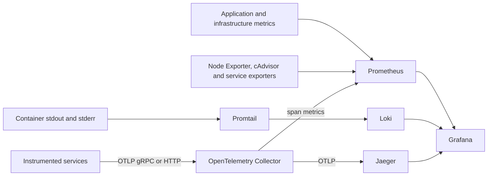

# Observability Architecture

This document describes the observability topology declared by
[`docker-compose.yaml`](../docker-compose.yaml) and the telemetry Helm
subchart. It supplements the canonical [system architecture](architecture.md).

## Signal topology



All edges above are configured platform paths. Whether a service emits a
particular signal depends on its instrumentation; see
[Instrumentation status](#instrumentation-status).

## Logs: Promtail to Loki

Promtail discovers Docker containers through the Docker socket and forwards
their logs to Loki. Loki is the durable query target for logs, and Grafana is
provisioned with a Loki data source.

Treat the Docker socket mount as privileged infrastructure access. Promtail
must stay on a trusted node. Applications should emit structured logs and must
not include API tokens, database credentials, raw search queries, session IDs,
full MAC addresses or captured payloads outside an explicitly audited path.

Compose endpoints:

- Loki: host-local `127.0.0.1:3100`
- Promtail status: container port `9080`, scraped inside the Compose network

## Metrics: Prometheus

Prometheus loads [`docker/observability/prometheus.yml`](../docker/observability/prometheus.yml)
and the alert rules in
[`docker/observability/alerts.yml`](../docker/observability/alerts.yml).
Declared scrape targets include:

- Prometheus, Loki, Promtail, Jaeger and the OTel Collector
- the proxy `/metrics` endpoint
- Atheros Sensor metrics through the host gateway
- Redpanda, MinIO, Node Exporter and cAdvisor
- the Pushgateway
- span metrics exported by the OTel Collector

The configuration also scrapes Octopus under its legacy
`java-coordinator` service identity. Both `/metrics` and the compatibility
route `/actuator/prometheus` expose its Micrometer measurements.

Compose endpoints:

- Prometheus: host-local `127.0.0.1:9090`
- Pushgateway: host-local `127.0.0.1:9091`
- Node Exporter: container port `9100`
- cAdvisor: host-local `127.0.0.1:8082`

## Traces: OTel Collector to Jaeger

The collector accepts OTLP on container ports `4317` (gRPC) and `4318` (HTTP).
Compose maps those to host-local `127.0.0.1:4317` and
`127.0.0.1:4320`. It batches traces, exports them to Jaeger over OTLP and sends
the same trace stream through a span-metrics connector. Prometheus scrapes the
span-metrics exporter on `9464`.

Jaeger is the trace store and query UI. Compose exposes its UI on host port
`16686`. Grafana is provisioned with Jaeger as a trace data source.

## Grafana

Grafana unifies the three query surfaces:

| Signal | Source |
|---|---|
| Metrics and alerts | Prometheus |
| Logs | Loki |
| Traces | Jaeger |

Compose exposes Grafana on host port `3004`. Anonymous access is disabled by
default; `GRAFANA_ADMIN_PASSWORD` is required.

## Instrumentation status

| Component | Logs | Metrics | Traces |
|---|---|---|---|
| Rust proxy/frontdoor | Container logs | Proxy/frontdoor Prometheus routes | OTLP configuration is wired |
| Atheros Sensor | Container logs | Prometheus server on `ATH_SENSOR_METRICS_PORT` | OTLP configuration is wired |
| Octopus | Structured logs | Micrometer registry exists, but no scrape endpoint is exposed | OTLP environment is declared by deployment |
| Atheros Search | Structured logs | Dedicated Prometheus server | HTTP/gRPC hooks exist, but no SDK exporter/provider is initialized |
| Redpanda, MinIO and host | Platform logs | Native endpoints/exporters | Not expected |

For Atheros Search, setting `OTEL_EXPORTER_OTLP_ENDPOINT` does not currently
create an exporter. The gRPC stats handler and HTTP trace-context logging use
the default no-op provider until server initialization installs an OTel SDK.

## Operating checks

```bash
curl -fsS http://127.0.0.1:9090/-/ready
curl -fsS http://127.0.0.1:3100/ready
curl -fsS http://127.0.0.1:3004/api/health
curl -fsS http://127.0.0.1:16686/
curl -fsS http://127.0.0.1:8888/metrics
```

If traces are absent, check the service instrumentation first, then collector
receiver health, collector logs and Jaeger reachability. If metrics are absent,
inspect Prometheus **Status -> Targets** and verify the path actually exists on
the service. If logs are absent, check Promtail discovery and Loki readiness.

## Security and retention

- Keep Grafana, Prometheus, Loki, collector diagnostics and service metrics
  bound to loopback or cluster-internal networks.
- Protect Grafana with a non-default password and the deployment identity
  provider where available.
- Treat labels as potentially sensitive; do not use raw user, query, session or
  full device identifiers as unbounded metric labels.
- Define Loki, Prometheus and Jaeger retention from the deployment's evidence
  and privacy requirements. Compose defaults are development settings, not a
  compliance retention policy.
