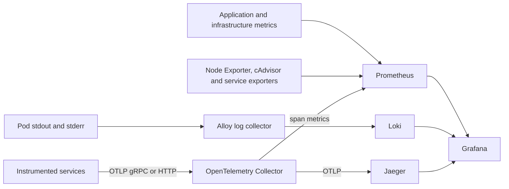

# Observability Architecture

This document describes the Kubernetes telemetry resources under
[`cyber-stack/base/telemetry`](../cyber-stack/base/telemetry/). It supplements
the canonical [system architecture](architecture.md).

## Signal topology

All edges above are declared Kubernetes paths. Whether a service emits a signal
depends on its instrumentation.

## Logs

The node log collector reads Kubernetes container logs and forwards them to
Loki. Treat host log mounts as privileged infrastructure access and keep the
collector on trusted nodes. Applications must not log API tokens, database
credentials, raw search queries, session IDs, full MAC addresses or captured
payloads outside an explicitly audited path.

## Metrics

Prometheus configuration and alert rules are stored in the telemetry
ConfigMaps. Declared scrape targets include:

- Prometheus, Loki, the log collector, Jaeger and the OTel Collector;
- proxy and Atheros Sensor metrics;
- Redpanda, MinIO, Node Exporter and cAdvisor;
- the Pushgateway and span-metrics exporter;
- Octopus under its `java-coordinator` Kubernetes identity.

Octopus exposes Micrometer measurements on `/metrics` and the compatibility
route `/actuator/prometheus`.

## Traces

The collector accepts OTLP on `4317` (gRPC) and `4318` (HTTP), batches traces,
exports them to Jaeger and emits span metrics for Prometheus. Grafana is
provisioned with Prometheus, Loki and Jaeger data sources.

## Instrumentation status

| Component | Logs | Metrics | Traces |
|---|---|---|---|
| Rust proxy/frontdoor | Structured pod logs | Proxy/frontdoor Prometheus routes | OTLP configuration is wired |
| Atheros Sensor | Structured pod logs | Prometheus server on `ATH_SENSOR_METRICS_PORT` | OTLP configuration is wired |
| Octopus | Structured logs | Micrometer exposition | OTLP SDK spans around Kafka and TiDB durable boundaries |
| Atheros Search | Structured logs | Dedicated Prometheus server | HTTP/gRPC hooks exist, but no SDK exporter/provider is initialized |
| Redpanda, MinIO and nodes | Platform logs | Native endpoints/exporters | Not expected |

For Atheros Search, setting `OTEL_EXPORTER_OTLP_ENDPOINT` does not currently
create an exporter. The handlers use the default no-op provider until server
initialization installs an OTel SDK.

## Operating checks

Use Argo CD health, pod status, service endpoints and Prometheus target status.
If traces are absent, check service instrumentation, collector receiver health,
collector logs and Jaeger reachability. If metrics are absent, inspect
Prometheus targets and verify the path exists. If logs are absent, inspect the
node collector and Loki readiness.

All configuration corrections belong in the telemetry base or environment
patches and must be merged through Git. Use read-only cluster commands to
collect evidence; do not edit telemetry resources interactively.

## Security and retention

- Keep Grafana, Prometheus, Loki, collector diagnostics and service metrics
  cluster-internal unless an approved ingress policy says otherwise.
- Protect Grafana with the platform identity provider and a non-default admin
  credential supplied by the platform secret control plane.
- Do not use raw user, query, session or device identifiers as unbounded metric
  labels.
- Define Loki, Prometheus and Jaeger retention from evidence and privacy
  requirements in the environment overlays.
