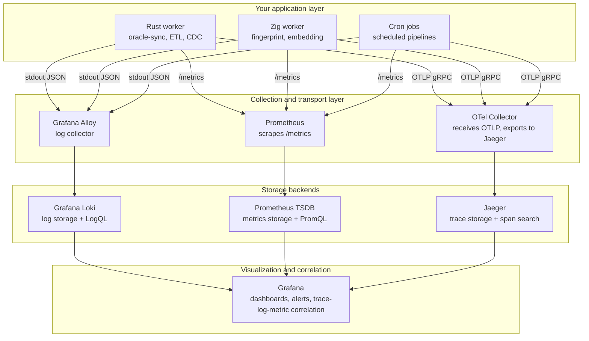

# Observability Architecture with Jaeger

## What changed with Jaeger

New trace path in the stack:

`workers -> OTLP gRPC -> OTel Collector -> Jaeger -> Grafana`

Rust and Zig workers now emit OTLP traces over gRPC. The OpenTelemetry Collector receives and forwards spans to Jaeger. Grafana reads Jaeger as a trace datasource and correlates traces with Loki logs and Prometheus metrics.

## Instrumentation first pass

| Signal type | Rust crate | Zig approach |
|---|---|---|
| Logs -> stdout | `tracing` + `tracing-subscriber` (JSON fmt) | custom JSON line writer or `zlog` |
| Metrics -> `/metrics` | `metrics` + `metrics-exporter-prometheus` | expose via simple HTTP handler |
| Traces -> OTLP | `opentelemetry` + `opentelemetry-otlp` | `opentelemetry-zig` or HTTP OTLP |

## Clickable architecture diagram

## Cron trace waterfall

```mermaid
flowchart LR
    R0["cron: fingerprint-pipeline<br/>trace_id=abc123<br/>27 s total"]
    S1["load_raw_events<br/>2 s"]
    S2["calculate_fingerprints<br/>3 s"]
    S3["pgvector_embedding<br/>18 s (bottleneck)"]
    S4["postgres_commit<br/>200 ms"]
    S5["oracle_sync<br/>3 s"]
    S6["publish_notification<br/>20 ms"]

    R0 --> S1 --> S2 --> S3 --> S4 --> S5 --> S6

    classDef bottleneck fill:#fde2e2,stroke:#b91c1c,stroke-width:2px,color:#7f1d1d;
    class S3 bottleneck;

    click R0 href "#q-trace-root" "Follow-up question"
    click S1 href "#q-trace-load-raw-events" "Follow-up question"
    click S2 href "#q-trace-calculate-fingerprints" "Follow-up question"
    click S3 href "#q-trace-pgvector-embedding" "Follow-up question"
    click S4 href "#q-trace-postgres-commit" "Follow-up question"
    click S5 href "#q-trace-oracle-sync" "Follow-up question"
    click S6 href "#q-trace-publish-notification" "Follow-up question"
```

`pgvector_embedding` is the visible bottleneck. Without Jaeger, you see only the 27 s total and lose phase-level latency attribution.

## Quick Grafana wiring

1. Add Jaeger as a Grafana datasource.
2. Include `trace_id` in structured JSON logs sent to Loki.
3. From a Loki log line, pivot to the matching Jaeger trace by `trace_id`.
4. Use Grafana dashboards to correlate trace spans with Prometheus metrics and Loki logs.

## Follow-up questions by node

### Rust worker
What span boundaries and attributes must be emitted for Oracle sync, ETL, and CDC so failures are actionable?

### Zig worker
Which fingerprint and embedding phases need child spans, and which dimensions should be tags versus logs?

### Cron jobs
Which scheduled pipelines must always create one root trace per execution, and what timeout alert should fire if the root span exceeds budget?

### Grafana Alloy
Which JSON fields from stdout logs are mandatory for routing, parsing, and cross-linking with `trace_id`?

### Prometheus (scrape)
What scrape interval and timeout keep metric freshness high without overloading workers?

### OTel Collector
What retry, batching, and backpressure settings prevent span loss during downstream outages?

### Loki
Which labels are required for query speed, and which fields must stay in log body to avoid cardinality explosions?

### Prometheus TSDB
Which SLO and saturation metrics should be retained at high resolution for incident triage?

### Jaeger
What retention window and sampling policy preserve enough traces to diagnose intermittent bottlenecks?

### Grafana
Which dashboard panels must support one-click pivot across trace, log, and metric views during incident response?

### Trace root (`fingerprint-pipeline`)
What run-level metadata (job id, schedule id, input size) is required on the root span for filtering and incident grouping?

### `load_raw_events`
Which source latency and row-count attributes are needed to separate input slowness from compute slowness?

### `calculate_fingerprints`
What CPU and batch-size dimensions should be captured to detect algorithmic regression?

### `pgvector_embedding`
What queue depth, model latency, and retry metadata must be attached to explain the 18 s bottleneck?

### `postgres_commit`
Which commit latency and lock-wait fields are needed to detect transactional contention?

### `oracle_sync`
What remote-call and payload attributes are needed to isolate Oracle-side latency from local pipeline latency?

### `publish_notification`
What broker ack and publish retry fields should be captured to detect delivery degradation early?
