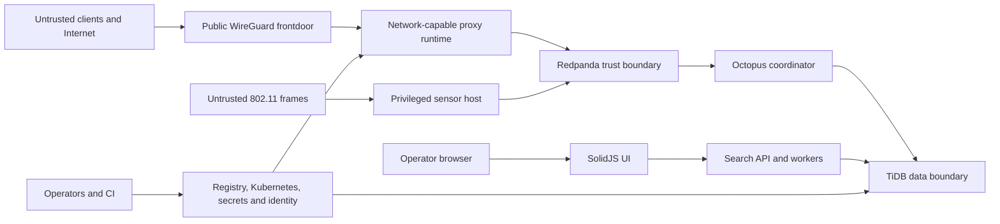

# SSL Proxy Threat Model

This threat model covers the runtime described in
[System Architecture](architecture.md). It is an engineering baseline, not a
completed compliance assessment.

## Assets

- WireGuard server, peer and rotation key material
- Proxy policy, classification and admin controls
- Redpanda event and work streams
- TiDB ingestion evidence, audit data, migration state, search documents and
  vectors
- MinIO archives and exports
- Search API credentials and privacy-sensitive analytics
- Deployment, registry, Kubernetes and identity-provider credentials
- Observability data that can reveal service, device or traffic behavior

## Trust boundaries

The proxy and sensor require elevated network access but deliberately receive
no direct database ownership. Octopus, Atheros Search and Schema Migrator are
direct TiDB clients with isolated accounts. The browser UI has no direct TiDB
credentials.

## Primary threats and controls

| Priority | Threat | Impact | Current controls | Remaining risk |
|---|---|---|---|---|
| P1 | Stolen WireGuard/admin/deployment credentials | Unauthorized traffic or control-plane access | File-backed secrets, separate accounts, staged rotation, host-local admin intent | Rotation SLAs and operator access review are deployment responsibilities |
| P1 | Audit suppression or replay manipulation | Loss of evidence and incorrect projections | Redpanda transport, durable TiDB dedupe, topic/partition/offset evidence, signed cutover boundary | Operator with TiDB and Kafka control can still damage evidence without external immutability |
| P1 | Exposed admin, TiDB or observability ports | Remote control or data disclosure | Loopback/cluster-internal defaults, API token support, Kubernetes network boundaries | Values and host firewall drift must be verified |
| P1 | Supply-chain or image-registry compromise | Arbitrary workload execution | Explicit registry workflow, pinned first-party build inputs, image pull checks | Signing/attestation enforcement is not complete |
| P2 | WireGuard UDP flood or session exhaustion | Availability loss | Session limits, queue bounds, optional rate limit, resource limits | Public UDP remains a denial-of-service surface |
| P2 | TLS/SNI or protocol evasion | Policy bypass | WireGuard-first routing, transparent TCP interception, classification taxonomy | Non-SNI, fragmentation and non-TCP paths require explicit policy testing |
| P2 | Wireless frame poisoning | False alerts or resource consumption | Parser hardening, schema-versioned events, bounded backlog and thresholds | Radio input is inherently unauthenticated |
| P2 | Search-query or device privacy leakage | Sensitive behavior disclosure | Hashed query/session analytics, token auth option, log redaction rules | Raw diagnostic opt-in columns and broad operator access require governance |
| P2 | Compromised direct TiDB client | Cross-domain data modification | Separate databases/accounts, TLS, grant matrix, manifest checks | Search and Octopus need table-level grants that match actual ownership |
| P3 | Dependency outage | Reduced ingestion, search or telemetry | Health/readiness, local outboxes, retries and DLQs | Some green health checks do not prove end-to-end wiring |

## Security invariants

- The Rust proxy, sync-plane crate and Atheros Sensor do not connect directly to
  TiDB.
- Wireless persistence goes through Redpanda and Octopus discovery flows.
- PostgreSQL is not an internal runtime fallback. It is allowed only as a
  Schema Migrator external target.
- `sync.oracle.load` and `sync.oracle.result` carry TiDB work despite their
  legacy names.
- Canonical DDL is applied only by the schema executor after checksum
  verification.
- Search workers write only their owned Atheros Search tables.
- Raw queries, session IDs, API tokens and full device identifiers are not
  placed in normal logs or metric labels.
- Admin, database, registry and observability surfaces are not public by
  default.

## Known control gaps

The architecture [Known gaps](architecture.md#known-gaps) affect security
assurance:

- Helm worker values are not passed to Atheros Search, and the standalone TiDB
  init job lacks worker write grants.
- Search tracing hooks do not initialize an exporter, reducing request-flow
  visibility.
- No current runtime owns `integration_console` tables.
- Single-node TiDB/UniStore does not provide production-grade failure
  tolerance or TiFlash readiness.
- The end-to-end search-document/job producer path is incomplete.

These gaps must not be hidden by a passing pod liveness probe.

## Required deployment review

Before production approval, document:

1. privileged operator count, role separation and MFA enforcement;
2. WireGuard, admin, TiDB, registry and identity credential rotation periods;
3. network-policy and host-firewall evidence for every exposed port;
4. audit retention, backup, restore, immutability and legal-hold requirements;
5. signed-image and dependency-vulnerability policy;
6. incident response SLA for ingestion evidence loss or cutover mismatch;
7. load and failure tests for WireGuard, Redpanda and TiDB/TiFlash;
8. privacy approval for Search analytics and diagnostic opt-ins.

## Validation cadence

Run access/grant reviews and restore drills at least quarterly, repeat
penetration tests after ingress or auth changes, and re-review this model when a
new direct database client, public endpoint, topic contract or secret class is
introduced.
