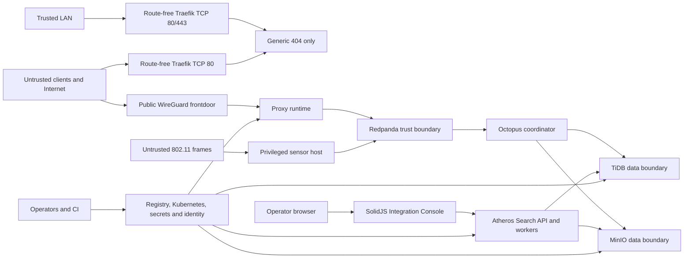

# SSL Proxy Threat Model

This threat model covers the current runtime described in [System Architecture](architecture.md), the TiDB ownership model in [TiDB Runtime and Cutover](tidb-runtime-cutover.md), and the live operational guardrails in [Secret Management](secret-management.md). It is an engineering baseline, not a completed compliance assessment.

## Assets

- WireGuard server, peer and rotation keys
- Proxy policy, classification and admin controls
- Redpanda topics and payload references, including `sync.scan.request`, `wireless.audit`, `sync.oracle.load` and `sync.oracle.result`
- Shared outbox references such as `inline://json/` and `outbox://...`, plus dedupe metadata and topic/partition/offset evidence
- TiDB data domains for `octopus_core`, `atheros_search`, `schema_migrator` and the reserved `integration_console` surface
- Search documents, embeddings, vectors, job lease tokens, fencing markers and query analytics
- MinIO archives, export data and object-lock retention state
- Registry, Kubernetes, identity-provider, TiDB and observability credentials
- Operational telemetry, including logs, traces, metrics and Grafana/Loki/Jaeger access
- The IPv4-only Traefik edge configuration, access logs and default-deny response metrics

## Trust boundaries

The proxy and sensor are privileged networking components but intentionally do not receive direct TiDB credentials. Octopus, Atheros Search and Schema Migrator are the direct TiDB clients, each with isolated accounts and domain-scoped grants. The browser UI has no direct TiDB credentials.

## Primary threats and controls

| Priority | Threat | Impact | Current controls | Remaining risk |
|---|---|---|---|---|
| P1 | Tampering or replay of `wireless.audit` or `sync.scan.request` | Duplicate ingestion, stale work, false evidence or incorrect projections | Event identity via schema-versioned event IDs; deduplication scope per topic/partition/offset with durable TiDB evidence; offset-reset behavior documented per topic; producer/consumer compatibility checks enforced at contract boundary; locked topic names, schema-versioned events, durable dedupe, replay-safe offsets, and per-topic/partition/offset evidence | Operators with Redpanda and TiDB control can still corrupt evidence if external immutability is not enforced |
| P1 | Topic confusion or contract drift across `sync.scan.request`, `sync.oracle.load`, `sync.oracle.result` and `wireless.audit` | Incorrect consumer behavior or hidden data loss | Topic names are compatibility surfaces and are intentionally locked; schema and semantic changes require review trigger that covers modifications to existing contracts, schemas or semantics—not only newly introduced topics; Octopus owns the durable boundary and evidence trail | A new producer or consumer path without schema review can still bypass the intended contract |
| P1 | Compromised direct TiDB client or over-broad grant | Cross-domain data modification, data exfiltration or projection corruption | Separate databases and accounts, verified TLS, table-level grant matrix, manifest checksum validation and fail-closed startup checks | Grant drift or misconfiguration can still enable accidental privilege creep |
| P1 | Search worker job hijack or embedding poisoning | Manipulated search results, incorrect document metadata or vector pollution | Workers must claim fenced jobs using lease ownership, commit tokens and atomic completion before a job is marked successful; writes remain scoped to the `atheros_search` database | Weak token rotation or broken lease ownership can still make worker intake unsafe |
| P1 | Exposed admin, TiDB, Search API, Grafana or observability ports | Unauthorized control-plane access, data disclosure or cross-service visibility | Every public endpoint is enumerated with port, allowed source network, authentication method and responsible owner: Proxy admin (port 3002, loopback, API key, proxy owner); Search API (configurable port, cluster-internal, token auth, search owner); Search UI (same host as Search API, cluster-internal, token auth, search owner); Octopus health (cluster-internal, unauthenticated liveness / authenticated readiness, coordinator owner); Grafana (cluster-internal, identity-provider auth, observability owner); Loki/Jaeger (cluster-internal, identity-provider auth, observability owner); all other TiDB and registry surfaces remain internal-only. Search API and UI must fail closed when authentication is absent. | Firewall drift, operator misrouting or accidental public exposure remain deployment risks |
| P1 | Accidental publication through the phase-one Traefik edge | An application, dashboard or administrative surface becomes reachable from the Internet before its hostname, TLS and authentication controls are reviewed | The platform team owns a K3s `HelmChartConfig/traefik` that listens on IPv4 TCP 80/443 for LAN verification, disables every routing provider and dashboard path, trusts no forwarded headers, and has no route, redirect or certificate resolver. The staged router and host policy exposes only TCP 80 to the WAN; TCP 443 remains closed. The workload AppProject cannot create HTTP route kinds. Repository checks reject provider, listener, route and allowlist widening. JSON access logs and Prometheus alerts cover edge loss, sustained request floods and any non-404 response. | Host-firewall and router state are external prerequisites. Forwarding remains prohibited until their evidence and independent reachability tests pass. |
| P1 | Supply-chain or registry compromise | Malicious image or workload injection | Explicit registry workflow, pinned first-party digests, image pull validation and GitOps reconciliation; deployment must include verifiable admission or image-pull evidence that rejects unsigned or unattested images, or a time-bounded risk acceptance with a named owner | Signing and attestation enforcement are not complete, so registry compromise remains a high-impact single point until admission control evidence or risk acceptance is documented |
| P1 | Compromised Jenkins pipeline or build engine | Registry poisoning and root-equivalent control over isolated Docker capability | Main-only managed job, private build network, no host Docker socket, mutual TLS and private bind addresses | Jenkins still runs trusted `main` branch code and remains a sensitive platform dependency |
| P2 | Proxy or sensor secret theft | Unauthorized routing control, API access or downstream data exposure | Secrets are mounted as private files, not stored in Git, and rotated through a dedicated workflow | Local dev artifacts, shell history or operator mistakes can leak values if procedures are not followed |
| P2 | Outbox or payload-reference tampering | Dangerous file reads, invalid payload resolution or deserialization issues | Canonical paths are enforced beneath an allowlisted root; traversal and symlink escapes are rejected; maximum payload size is enforced; all resolved payloads are strictly parsed and validated against the expected JSON schema before consumer access; `inline://json/` and `outbox://` are the only supported schemes; Octopus owns the durable boundary | A new producer path without schema validation may still bypass the intended contract |
| P2 | MinIO bucket policy, retention or immutability drift | Unauthorized object access, missing legal-hold capability or unbounded data deletion | Bucket creation via init script, credentials mounted from Vault-sourced Secret, health probes on port 9000 | Init script does not enable versioning or object lock; bucket policy and WORM controls require manual configuration and periodic audit |
| P2 | Wireless frame poisoning | False alerts, noisy backlog, resource waste or downstream incorrect search documents | Parser hardening, schema-versioned events, bounded backlog and work-item thresholds | Radio input is inherently unauthenticated, so some attacks cannot be fully eliminated |
| P2 | WireGuard UDP flood or session exhaustion | Availability loss at the public ingress | Session limits, queue bounds, optional rate limits and resource constrain  ts | Public UDP remains a denial-of-service surface |
| P2 | TLS/SNI or protocol evasion | Policy bypass or inconsistent classification | WireGuard-first routing, transparent TCP interception and classification taxonomy | Non-SNI, fragmentation, obfuscation and non-TCP paths require explicit policy validation |
| P2 | Search-query or device privacy leakage | Disclosure of sensitive behavior or operator-only metadata | Hashed analytics by default, redaction rules, no raw query/session identifiers in normal logs and token-based Search auth option | Raw diagnostic opt-ins and broad operator access still require governance and a clear legal basis |
| P3 | Observability blind spots and incomplete tracing export | Hidden failures, incomplete replay analysis or delayed incident response | Logs and metrics are routed through Alloy/Loki/Prometheus; traces are emitted to OTLP collectors | Atheros Search tracing hooks exist but the exporter is not initialized, so request-flow visibility remains incomplete |
| P3 | Dependency outage or partial service degradation | Reduced ingestion, search and telemetry fidelity | Health checks, local backlog, retries and durable boundaries | Some readiness checks show process liveness but not full end-to-end contract verification |

## Security invariants

- The Rust proxy, sync-plane crate and Atheros Sensor do not connect directly to TiDB.
- Wireless persistence flows through Redpanda and the Octopus discovery pipeline; the sensor does not own database state.
- PostgreSQL is not an internal runtime fallback. It is allowed only as a Schema Migrator external target.
- The canonical schema manifest is applied only by the provisioning schema executor after checksum verification.
- `sync.scan.request`, `wireless.audit`, `sync.oracle.load` and `sync.oracle.result` keep fixed meanings and are not renamed during runtime cutover.
- Search workers may write only their owned `atheros_search` tables and must complete jobs within the claimed fence/lease path.
- Search analytics use keyed hashing (HMAC with a protected, rotatable key) rather than raw query text, session IDs or device identifiers by default; unkeyed hashes are not used for analytics.
- HMAC keys are stored outside the application source, rotated at least quarterly, and accessible only to services that write or query analytics.
- Hashed query, session and device identifiers are classified as pseudonymous data unless a privacy review establishes a different classification.
- Diagnostic opt-ins that expose raw queries, session data or device telemetry require explicit operator consent, a documented legal basis, and a defined retention period that is enforced at the storage layer.
- Raw queries, API tokens, session identifiers and full device identifiers are not placed in normal logs or metric labels.
- Public ingress is limited to the existing WireGuard UDP entrypoint and the route-free, IPv4-only Traefik TCP 80 edge. Traefik TCP 443 remains LAN-testable but is not WAN-forwarded. Phase one returns only Traefik's generic 404; admin, application, DB and observability surfaces remain internal.
- The phase-one Traefik edge has no Ingress, Gateway, HTTPRoute, IngressRoute or Middleware authorization. Adding one requires a separate publication review covering hostname ownership, trusted TLS, authentication/MFA, middleware and route authorization.
- Jenkins and the privileged Docker-in-Docker engine remain on a private build network and never receive the host Docker socket.
- The browser UI does not directly access TiDB and must use the Search API/gateway boundary.
- `inline://json/` and `outbox://` references are the only supported payload-reference forms for Redpanda-backed work items.

## Known control gaps

These are current limitations and must not be hidden by a passing readiness probe. Every gap must have an owner, severity, affected environment, required exit evidence, and production-blocking status. Readiness-probe success alone does not constitute gap closure.

| Gap | Owner | Severity | Affected environment | Required exit evidence | Production-blocking |
|-----|-------|----------|---------------------|----------------------|-------------------|
| TiDB runs on UniStore in dev overlay | platform-team | P1 | dev | TiFlash placement test, distributed fault tolerance test, vector-index readiness validation | Yes — blocks prod unless dev parity demonstrated |
| No runtime owns `integration_console` tables | search-team | P1 | all | Explicit ownership assignment or documented risk acceptance | Yes — blocks prod unless ownership resolved |
| Atheros Search OTLP exporter not initialized | search-team | P2 | all | Traces exported to Jaeger and verified in dashboard | No — observability gap, not data-path |
| Dev worker settings need render validation; TiDB init job lacks worker-write grants | platform-team | P2 | dev | Render validation pass, grant matrix verified | No — dev-only |
| End-to-end search document/job producer flow incomplete | search-team | P1 | all | Embedding pipeline runs end-to-end with verified output | Yes — blocks prod unless pipeline proven |
| Operational checks confirm liveness, not data integrity | platform-team | P2 | all | End-to-end contract verification across all services | No — readiness improvement, not data-path |
| Node firewall, router forwarding and public IPv6 rejection are not yet evidenced | platform-team | P1 | prod Internet edge | Recorded host ruleset and listener inventory; router DMZ/WAN administration/UPnP/NAT-PMP disabled; no AAAA record; internal tests prove Traefik TCP 80/443 returns only `404`, and independent external scans prove only IPv4 TCP 80 plus the approved WireGuard UDP entrypoint are reachable while TCP 443 is closed; matching access logs and metrics are visible | Yes — router forwarding must remain disabled until evidence is approved |

Release-gate criteria: Production approval is blocked when any P1 invariant or end-to-end check remains unverified. A readiness probe returning success does not count as closure for any gap listed above.

## Required deployment review

Before production approval, document:

1. privileged operator count, role separation and MFA enforcement;
2. WireGuard, admin, TiDB, registry and identity credential rotation periods;
3. network-policy and host-firewall evidence for every exposed port;
4. audit retention, backup and restore requirements, including legal hold and evidence immutability;
5. signed-image, vulnerability and dependency policy;
6. incident-response SLA for evidence loss, replay mismatch or cutover disagreement;
7. load and failure tests for WireGuard, Redpanda, TiDB/TiFlash and Search worker jobs;
8. privacy approval for Search analytics, embedding data and any diagnostic opt-ins;
9. operator access review for Loki, Grafana, Jaeger, MinIO bucket policies and cluster-admin paths;
10. secret synchronization checks for Vault/Kubernetes contract completeness and drift detection.
11. router, node-firewall and public IPv6 evidence for the Internet edge, including the reserved `.242` NAT target and rollback owner.

## Validation cadence

Run access/grant reviews and restore drills at least quarterly, repeat penetration tests after ingress or auth changes, and re-review this model whenever a new direct database client, public endpoint, topic contract, secret class or worker pipeline is introduced.

This document should be reviewed alongside [secret-management.md](secret-management.md), [atheros-search-privacy.md](atheros-search-privacy.md), [architecture.md](architecture.md) and [tidb-runtime-cutover.md](tidb-runtime-cutover.md). The architecture is only as safe as the least-trusted boundary and the weakest deployment control.
