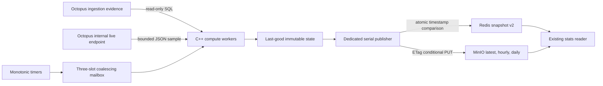

# Octopus Metrics

Dedicated C++23 replacement for Octopus's Scala snapshot materializer. It reads
authoritative ingestion evidence, samples coordinator telemetry, and publishes
the existing snapshot v2 to Redis and MinIO. Kafka ingestion, deduplication,
leases, processor supervision, projections, and MinIO payload archival stay
in [Octopus](../octopus/README.md). The public
[stats reader](../stats-reader/README.md) remains a store-only Go service.

The service is implemented and independently buildable. Production promotion
requires a reviewed image digest, a provisioned metrics account, and GitOps
integration. The public gateway uses the store-only stats reader; activation
of this publisher is still a separate prerequisite for fresh C++ snapshots.

## Step-by-step review of the extracted Scala worker

These findings refer to the former Scala components, which have been deleted
along with their publishing configuration, worker-only SQL, and Jedis dependency.
The diagnostic coordinator stats endpoint and ingest instrumentation remain.

| Former component | Evidence and bottleneck | Replacement and tradeoff |
| --- | --- | --- |
| `MetricWorkerPool` | `Queue.unbounded` accumulated every timer event during slow reads. Worker count bounded fibers, but did not bound pending jobs. | Fixed three-slot MPMC mailbox, one outstanding refresh of each kind, including active work. Overload discards redundant refresh requests; no measured ingestion records enter this queue. |
| `StatsMaterializerStream` | Four independent timers queued equivalent refreshes and publishers; workers could run multiple publishes concurrently. | Monotonic scheduler, fixed `std::jthread` pool, separate serial publisher. No catch-up burst after delays. |
| `MetricWorkerPool.runGuarded` | `IO.race` requests cancellation and waits for the loser. JDBC/Jedis/MinIO `IO.blocking` operations may finish before cancellation completes. It is not a hard I/O deadline. Raw exception messages could also reach worker logs. | libpq nonblocking connect/flush/read polling, stop tokens, transaction-local statement timeout, connection disposal on failure; curl deadlines and bounded hiredis calls. Errors are a closed enum and logs contain fixed event names. Resolver and Redis cancellation limits are described below. |
| `PostgresMetricsRepository` | Shared Hikari permits and pool competed with coordinator work. Three lifetime/peak scans and two overlapping history queries ran per refresh. | Separate read-only role and at most worker-count plus one publisher connection. One materialized daily-count CTE supplies both peaks and lifetime totals; one seven-day read supplies both histories. These measurement groups now succeed or fail together. |
| `StatsMaterializer` | Seven separate `Ref` reads could combine values from different refresh generations. Timestamp guards protected some caches, but the live cache used unguarded `set`. | One brief cache mutex copies a coherent immutable state; every part update rejects older measurement timestamps. SQL and stores execute outside the lock. |
| `fillHourly` | Persistent lists, per-bucket timestamp strings, a map, and last-write-wins duplicate handling allocated repeatedly. | Stack-bounded row array, strict timestamp/count validation, duplicate rejection, contiguous 168-count array with implicit UTC bucket positions. The 24-hour series is a slice of the same measurement. |
| `StatsStores` | JSON was encoded and copied into bytes for each store/object. `SETEX` and unconditional object writes permitted an older publisher to overwrite a newer snapshot; the unused Redis lock did not prevent this. `rediss` was stripped without enabling TLS. | Serialize once into a fixed 32 KiB PMR arena, reuse the bytes for all writes, Redis atomic Lua timestamp comparison, MinIO ETag conditional writes. Unsupported Redis URI schemes fail configuration instead of losing their transport meaning. |
| Live-strip source | The scheduled ledger pass may process zero while locked consumers persist records directly. Sampling a load-balanced coordinator is not a fleet sum. | Read-only `/internal/metrics/live` reports successfully committed broker deliveries and optional broker fetch-position lag separately from pending ledger rows. Warm-up and freshness gates remain. Configure a specific source for stable pod semantics; fleet aggregation needs a separate contract decision. |

The principal remaining throughput cost is exact PostgreSQL aggregation over
all retained ingestion evidence. Changing language does not remove that scan.
The service does not introduce runtime aggregate tables or a new Kafka consumer.
Nested `parTupled` operations also meant that three Scala worker fibers could
issue more than three concurrent queries. The C++ worker executes one effect at
a time, making its database connection budget explicit. Scala's recursive
`IO` worker loop was stack-safe through the effect runtime; its C++ replacement
uses an iterative loop instead of translating that recursion literally.

## Architectural blueprint



| Scala model | C++ equivalent |
| --- | --- |
| `Resource` / bracket | RAII destructors and `unique_ptr` custom deleters for connections, results, replies, curl handles, header lists, sockets, and threads |
| `IO[A]` effect boundary | Explicit repository/store operations with `Result<A>` (`std::expected<A, Error>`); pure transformations accept values and timestamps |
| `parTraverse_` fibers | Fixed joinable `std::jthread` workers, thread-confined clients, shared stop source; every thread is joined before state/resources are destroyed |
| `Queue.take` | Condition-variable wait with stop token; queue storage never allocates |
| `Ref.update` | Short mutex-guarded, timestamp-ordered replacement; readers receive a value copy |
| `awakeEvery` | `steady_clock` scheduling; wall clock is used only for measurement timestamps and UTC windows |
| `Option` | Typed `std::optional`, preserving unknown/null separately from measured zero |
| Typeclass constraints | C++ concepts constrain the numeric writer; expected/optional make invalid and absent results explicit |

`std::jthread` supplies lifetime management, not preemptive cancellation. Tokens
must be checked at effect boundaries. The implementation uses supported C++23
facilities; it does not depend on a sender/receiver implementation.

The mutex-based mailbox is intentional: there are only three low-frequency job
kinds, and waiting workers sleep. A lock-free ring would add reclamation and
shutdown complexity without addressing SQL or network costs. Likewise,
`atomic<shared_ptr>` is not assumed to be lock-free. Large immutable graphs and
shared ownership are unnecessary for this fixed-size cache.

Source map: [domain transformations](src/domain.cpp),
[cache and types](include/metrics/domain.hpp), [mailbox](include/metrics/queue.hpp),
[I/O adapters](src/adapters.cpp), [runtime](src/service.cpp),
[entrypoint](src/main.cpp), and [configuration](src/config.cpp).

## Memory and latency behavior

- libpq numeric/timestamp parsing consumes `string_view` directly over an owned
  result; borrowed views do not leave the result lifetime. At most 168 sparse
  rows are converted into stack storage. The dense numeric series is contiguous,
  avoiding linked nodes and per-bucket timestamp storage.
- HTTP bodies are capped at 64 KiB. simdjson on-demand strings borrow a padded
  input during parsing, then are converted to owned scalar values. Padding
  currently entails one bounded input copy; this is not end-to-end zero-copy.
- Each snapshot uses one 32 KiB stack arena with `null_memory_resource` upstream,
  so an unexpected size cannot silently grow the heap. Numeric serialization
  uses `to_chars`; timestamps append directly into the arena without per-bucket
  owning strings. Only generated timestamps enter quoted JSON fields.
- C libraries retain their own buffers and allocate internally. RAII prevents
  application ownership leaks but does not make third-party allocation disappear.
- Database operations are read-only transactions with bound parameters and
  statement deadlines. Every read and every publication checks the build's
  canonical manifest version/checksum against `schema_readiness`. Runtime never
  applies DDL or accepts an environment override for the expected checksum.
- A blocked/failed query loses its connection and retries on the next timer.
  Computation and store publication use separate threads and connection budgets.
- Redis and each object operation have independent deadlines so one destination
  outage cannot consume another destination's budget. S3 compare-and-swap retries
  are limited to three attempts under the same object deadline.

System hostname resolution can block outside libpq/curl I/O polling; hiredis
commands have socket deadlines but cannot be interrupted immediately by a stop
token. Use reliable local DNS or configured numeric destinations and allow at
least the configured I/O timeout plus a safety margin for termination. No thread
is detached to pretend a blocked operation has been cancelled.

## Snapshot and failure contracts

Top-level fields are `asOf`, `peaksComputedAt`, `peakRecordsDay`,
`peakRecordsDayDate`, `peakRecordsWeek`, `peakRecordsWeekStart`,
`peakRecordsWeekEnd`, `liveStrip`, `lifetimeTotals`, `throughput24h`, and
`throughput7d`. Existing nested keys, Redis key, and object paths are preserved.

Historical counts cover ingestion evidence rows of every disposition, as before. Peak ties
select the earliest UTC day/week. Weeks begin Monday and end Sunday. A successful
empty ledger yields null peaks, zero lifetime counts, and dense measured-zero
history. Failed initial reads stay null; later failures retain last-good parts
and their original timestamps. Measured history remains available after hour
rollover with its original bucket times. A cold process waits for aggregate and
history measurements before publishing, preserving the previous durable snapshot
when initial reads fail. Live data is omitted after 60 seconds or when the source reports
unavailable telemetry. Source timestamps may lead the local clock by up to five
seconds; larger future offsets or malformed timestamps are rejected.

Live `ingestProcessedRatePerSec` is the five-minute average of successfully
committed broker deliveries, including replay and parked records; it is separate
from historical evidence counts. `pendingLedgerCount` covers pending/processing
ledger rows. Optional `brokerLagCount` covers fresh fetch-position lag across the
source coordinator's consumers and excludes already-fetched records. Older
bridges omit it; missing or null remains null, never zero. Store readers must
allowlist this field before the source revision is promoted.

Redis's Lua comparison normalizes fractional UTC timestamps before comparing.
MinIO reads the current object and ETag, compares `asOf`, then uses `If-Match` or
`If-None-Match: *` to fence the update. Competing publishers retry conflicts or
leave the newer object intact. Stores can temporarily differ because there is
no distributed transaction between Redis and MinIO. Older server releases that
ignore conditional PUT headers are unsupported; verify this with the real
adapter tests before promotion. Buckets must be provisioned outside the service.

The health port serves `/live`, `/ready`, and Prometheus `/metrics`. Liveness
does not query dependencies. Readiness requires recent aggregate/history
measurements and a recent successful publication to at least one snapshot
destination; it never affects coordinator readiness. Worker failures, coalesced
jobs, completed refreshes, and successful publications have counters. Logs
contain no payloads, credentials, hostnames, or raw dependency error messages.

## Configuration

All listed values are validated at startup. Secrets come from deployment inputs.

| Variable | Default | Startup/behavior |
| --- | --- | --- |
| `POSTGRES_HOST` | `postgres-pgbouncer` | Required nonempty network destination |
| `POSTGRES_PORT` | `5432` | Integer 1-65535; matches the stack's PgBouncer listener |
| `POSTGRES_DATABASE` | `sync` | Required nonempty domain database |
| `POSTGRES_USER` | `octopus_metrics` | Separate read-only runtime role; `postgres` rejected |
| `POSTGRES_PASSWORD` | empty | Required secret; mutually exclusive with password file |
| `POSTGRES_PASSWORD_FILE` | unset | Optional bounded secret file, preferred over environment password |
| `POSTGRES_SSL_MODE` | `verify-full` | Only verified TLS in production |
| `POSTGRES_SSL_CA_PATH` | `/etc/postgres/tls/ca.crt` | Mounted CA, required in production |
| `POSTGRES_SSL_SERVER_NAME` | `postgres-pgbouncer` | TLS identity; destination is resolved separately when different |
| `STATS_LOCAL_DEV` | `false` | Explicit test-only allowance for `POSTGRES_SSL_MODE=disable` |
| `STATS_WORKER_COUNT` | `3` | Fixed compute pool, 1-8 |
| `STATS_HTTP_PORT` | `9092` | Health/metrics port, 1-65535 |
| `STATS_PEAKS_INTERVAL_SECONDS` | `300` | Aggregate refresh, 1-86400 |
| `STATS_HISTORY_INTERVAL_SECONDS` | `60` | Seven-day history refresh, 1-3600 |
| `STATS_LIVE_INTERVAL_SECONDS` | `15` | Coordinator sample cadence, 1-60 |
| `STATS_PUBLISH_INTERVAL_SECONDS` | `30` | Snapshot publish cadence, 1-3600 |
| `STATS_JOB_TIMEOUT_SECONDS` | `60` | Per I/O operation budget, 1-300 |
| `STATS_OCTOPUS_LIVE_URL` | `http://ssl-proxy-java-coordinator-live:8080/internal/metrics/live` | Dedicated internal service publishes unready pod addresses; port 8080 targets pod port 8081; no URL credentials or redirects |
| `REDIS_ADDR` | `ssl-proxy-redis-runtime:6379` | Plain host:port; bracketed IPv6 accepted; URI schemes rejected |
| `REDIS_PASSWORD` | empty | Optional internal Redis AUTH secret |
| `STATS_REDIS_KEY` | `stats:current:v2` | Validated snapshot key |
| `STATS_REDIS_TTL_SECONDS` | `180` | 1-86400; must exceed publish interval |
| `MINIO_ENDPOINT` | `http://ssl-proxy-minio-api:9000` | Internal HTTP(S) S3 endpoint |
| `MINIO_ACCESS_KEY_ID` | empty | Required scoped S3 credential |
| `MINIO_SECRET_ACCESS_KEY` | empty | Required scoped S3 credential |
| `MINIO_REGION` | `us-east-1` | Explicit SigV4 region |
| `MINIO_STATS_BUCKET` | `ssl-proxy-stats` | Existing provisioned bucket |
| `MINIO_STATS_PREFIX` | `stats/` | Validated prefix; latest/history/daily keys beneath it |

The Redis adapter uses the existing internal plaintext transport. A TLS-only
Redis deployment requires a TLS adapter; it fails configuration for a `rediss`
URI rather than downgrading it. PostgreSQL verify-full and HTTPS retain library
certificate/hostname verification. Secret contents are never logged.

The [metrics grant fixture](../../sql/postgres/octopus_core/grants/metrics_read_only.sql.tmpl)
grants only the evidence timestamp and schema-readiness columns. Provision the
role externally with no inherited writer membership; count queries do not
need access to event payloads. The compiled checksum comes from the
[canonical manifest](../../sql/postgres/octopus_core/manifest.yaml).

## Build and verification

Dependencies: C++23 compiler/library with `expected` and stop-token waits,
CMake 3.25+, libpq, libcurl 7.85+, hiredis 1.2+, and simdjson 3+.

```sh
cmake -S services/octopus-metrics -B /tmp/octopus-metrics -DCMAKE_BUILD_TYPE=Release
cmake --build /tmp/octopus-metrics --parallel 2
ctest --test-dir /tmp/octopus-metrics --output-on-failure
```

On Homebrew systems add `-DPostgreSQL_ROOT=/opt/homebrew/opt/libpq` if discovery
requires it. The root shortcut is `make octopus-metrics-test`.

For memory checks configure with `-DMETRICS_SANITIZE=ON`. For data races use a
separate build tree with `-DMETRICS_TSAN=ON`. For Linux x86-64 CI, the
[TSan runner](../../scripts/ci/tasks/metrics-tsan-test.sh) uses `setarch -R`
only for CTest and its instrumented children. This avoids GCC TSan startup
collisions with high-entropy ASLR. Docker's default seccomp filter blocks the
needed `personality` call, so the disposable x86-64 Jenkins metrics test
container uses `seccomp=unconfined`. Host sysctls, runtime images, and production
pod security settings remain unchanged. Race reports and permission errors
still fail CI; there is no retry or unsanitized fallback. See the
[upstream runtime issue](https://github.com/google/sanitizers/issues/1716).
The
[core tests](tests/core_test.cpp) cover timestamp/count validation, missing/zero
semantics, UTC windows, expiration, out-of-order cache updates, MPMC contention,
overload coalescing, and cancellation. The
[adapter contracts](tests/integration_test.py) use temporary Testcontainers:

```sh
python3 -m venv /tmp/octopus-metrics-tests
/tmp/octopus-metrics-tests/bin/python -m pip install -r services/octopus-metrics/tests/requirements.txt
/tmp/octopus-metrics-tests/bin/python services/octopus-metrics/tests/integration_test.py --build /tmp/octopus-metrics
```

The integration suite applies the canonical schema only inside its scratch
PostgreSQL container, verifies least privilege, UTC semantics, empty evidence,
schema drift, blocked-query deadlines, real Redis Lua, real S3 signing and
conditional PUT ordering, full service publication, health, and signal shutdown.
Missing Docker is a test failure, not a silent integration success. The
[GitHub CI workflow](../../.github/workflows/ci.yml) runs these checks and builds the
image. The [root Jenkinsfile](../../Jenkinsfile) also runs memory/thread
sanitizers and the real adapters through the
[metrics test runner](../../scripts/ci/octopus-metrics.sh). Changes to the service,
canonical manifest, or shared image inputs select candidate publication.
Jenkins archives `artifacts/octopus-metrics-buildx.json` with the pushed digest;
it does not promote that digest into production. See
[Jenkins Image CI](../../docs/jenkins-ci.md).

Build the standalone image with repository root context:

```sh
docker build -f services/octopus-metrics/Dockerfile -t octopus-metrics:test .
```

The [Dockerfile](Dockerfile) runs as UID 65532 with runtime libraries installed
from the matching Debian distribution. It does not publish or select a production digest.

## Kubernetes mapping

The [Kustomize base](../../cyber-stack/base/octopus-metrics/kustomization.yaml)
contains a singleton Deployment, internal health Service, TLS CA/password mounts,
resource requests/limits, and network policies for the live bridge, PgBouncer,
Redis, MinIO, and DNS. Recreate updates avoid duplicate SQL refreshes. Readiness
depends on successful publication; liveness does not depend on external stores.
Initial sizing must be measured under retained-evidence load before promotion.

The base also owns `ssl-proxy-java-coordinator-live`, an internal telemetry
Service with `publishNotReadyAddresses: true`. It selects coordinator pods even
while their processing readiness fails, so ingestion health cannot hide live
diagnostic measurements. The regular coordinator Service keeps its readiness
gate; network policies still restrict access to pod port 8081.

This base is not yet included in either environment's canonical app-stack.
No registry digest is fabricated, and the current platform-input contract does
not yet provision the new `postgres-octopus-metrics` or `octopus-metrics-store`
Secrets. Activation is a reviewed change containing all of the following:

- Register the externally provisioned `octopus_metrics` account and its password
  Secret, including the PgBouncer userlist, in the
  [platform input contract](../../cyber-stack/platform-input-contract.yaml).
  Add the `octopus-metrics-store` Secret with `access-key` / `secret-key` for a
  scoped S3 writer. Update platform-sync target shells, environment patches and
  generated RBAC together; existing Redis and listener-CA Secrets are reused.
- Add `../../../base/octopus-metrics` only to each selected environment's
  `app-stack` Kustomization and map logical image `octopus-metrics` to the
  registry repository and the reviewed Jenkins digest. Add the service to
  `scripts/image_contract.py` and the Makefile's deployable inventory at that
  point so subsequent digest updates follow the existing promotion contract.
- Promote the coordinator revision that exposes `/internal/metrics/live` and
  removes the Scala publisher before using the production snapshot destinations.
  Add the worker's internal `/metrics` target to the telemetry configuration.
  Render and validate both environments with `make gitops-check`.

The application defaults and base agree on `postgres-pgbouncer:5432`,
`verify-full`, the listener TLS identity, and `/etc/postgres/tls/ca.crt`.
Do not reuse the coordinator's writer account. The new password Secret and
scoped S3 Secret are deliberate provisioning prerequisites; this change does
not require them in the currently deployed platform contract.

## Production cutover and performance acceptance

1. Provision the separate read-only PostgreSQL account using the canonical
   grant fixture; provision the stats bucket and a scoped object credential.
   Confirm the deployed manifest matches the binary's compiled checksum.
2. Build and review the service image digest. Activate the prepared base in the
   single app-stack slice per environment through reviewed changes under `cyber-stack/`.
   Render all environment variables, CA mount, secret references, health probes,
   resource limits, and network-policy access together. No placeholder digest
   or automatic production promotion is supplied by this change.
3. Keep the live bridge internal. Verify the source pod semantics and existing
   coordinator warm-up/freshness behavior. Configure PostgreSQL connection and
   TLS identity from the same platform contract used by other runtime clients.
4. First publish to isolated Redis keys and MinIO prefixes. Compare all fields
   against evidence queries, exercise dependency failures and competing writes,
   and verify conditional S3 behavior on the actual target server release.
5. Retire the old coordinator publishing image before directing the new service
   at the production snapshot destinations. The old writer uses unconditional
   writes and must not overlap the C++ writer. Promote the paired coordinator
   and metrics revisions through Argo CD; rollback through reviewed Git/image
   reverts. Reader/gateway promotion follows its existing rollout contract.
6. Measure with representative retained evidence and ingestion load: query
   `EXPLAIN (ANALYZE, BUFFERS)`, client p50/p95/p99, rows/second, statement
   timeout rate, database pool demand, publisher latency, peak RSS, coalesced
   jobs, and coordinator ingestion latency before/after. Do not benchmark SQL
   performance from an empty database or infer fleet throughput from a pure
   transformation benchmark.

Default cadences preserve existing behavior: 15-second live sampling and
30-second publication are not sub-millisecond freshness. Lower cadences only
after measuring SQL/store capacity. No production throughput or latency gain is
claimed without those measurements. For larger evidence retention, a separate
design may be needed for append-only projection maintenance; this migration
does not revive runtime aggregate tables.

Implementation references:
[libpq asynchronous processing](https://www.postgresql.org/docs/current/libpq-async.html),
[curl deadlines](https://curl.se/libcurl/c/CURLOPT_TIMEOUT_MS.html),
[curl SigV4](https://curl.se/libcurl/c/CURLOPT_AWS_SIGV4.html),
[hiredis ownership and timeout options](https://github.com/redis/hiredis), and
[simdjson on-demand lifetimes](https://github.com/simdjson/simdjson/blob/master/doc/basics.md).
